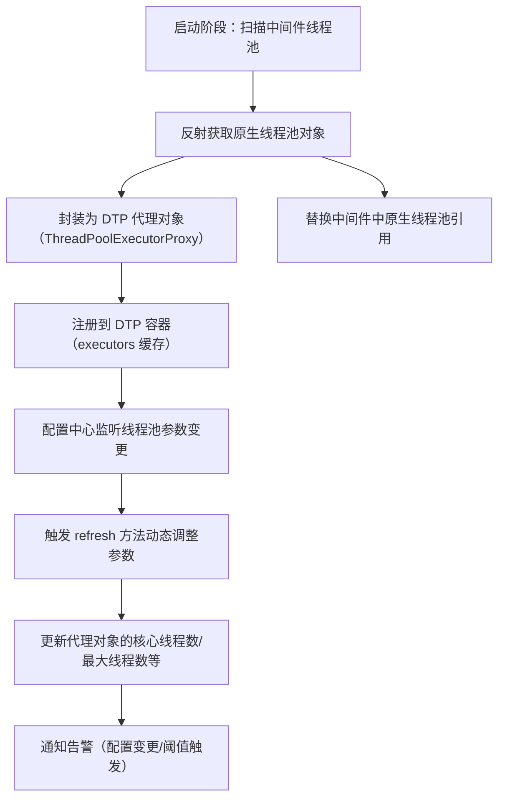
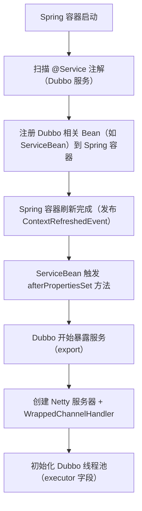

你问的 Dynamic-Tp（简称 DTP）支持中间件线程池动态化的核心逻辑是：**通过「适配器模式 + 反射增强 + 配置监听」三板斧，无侵入地接管中间件原生线程池，实现参数动态调整、状态监控、变更通知等能力**。

下面我会从「核心原理、适配流程、典型中间件适配案例」三个维度拆解，让你清楚 DTP 是如何把 Dubbo、RocketMQ、Tomcat 等中间件的线程池“改造”成动态线程池的。

### 一、核心原理：DTP 适配中间件线程池的通用逻辑
DTP 对所有中间件的适配都遵循统一的“骨架逻辑”（也就是你之前看到的 `AbstractDtpAdapter` 抽象类），核心步骤如下：


#### 关键技术点拆解：
1. **适配器模式（核心骨架）**
   DTP 为每个中间件提供专属的 `DtpAdapter` 实现类（如 `DubboDtpAdapter`、`RocketMqDtpAdapter`），继承 `AbstractDtpAdapter`，仅需实现：
    - `getTpPrefix()`：标识中间件类型（如 `dubbo`、`rocketmq`）；
    - `initialize()`：自定义扫描/获取中间件线程池的逻辑。
      通用逻辑（如参数刷新、监控、通知）全部复用抽象类，做到“通用逻辑封装，差异化逻辑扩展”。

2. **反射增强（无侵入接管）**
   中间件的线程池通常是私有的（如 Dubbo 的 `ThreadPoolExecutor` 是 `AbstractProtocol` 的私有字段），DTP 通过反射：
    - 定位中间件中存储线程池的字段（如 Dubbo 的 `executor` 字段）；
    - 创建 `ThreadPoolExecutorProxy`（DTP 核心代理类）包装原生线程池；
    - 替换中间件中原生线程池的引用为代理对象；
    - 优雅关闭原生线程池，避免资源泄漏。

3. **配置监听（动态刷新）**
   DTP 对接 Nacos/Apollo/ETCD 等配置中心，监听 `${middleware}.tp.*` 格式的配置（如 `dubbo.tp.corePoolSize=20`）：
    - 配置变更时触发 `refresh` 方法；
    - 按“先改最大线程数，后改核心线程数”的规则调整代理对象参数；
    - 对比参数变更前后的差异，触发钉钉/邮件/短信通知。

4. **状态监控（数据采集）**
   代理对象 `ThreadPoolExecutorProxy` 重写了 `execute`/`submit` 等方法，实时采集：
    - 核心指标：核心线程数、最大线程数、活跃线程数、队列大小、拒绝次数；
    - 行为指标：任务执行耗时、任务提交数、完成数、异常数；
    - 指标暴露：通过 Endpoint 暴露给 Prometheus/Grafana，或推送给监控平台。

### 二、典型中间件适配案例（以 Dubbo 为例）
Dubbo 是 DTP 适配最典型的中间件，我们以它为例看具体实现：

#### 步骤1：DubboDtpAdapter 实现（差异化逻辑）
```java
// Dubbo 专属适配器
public class DubboDtpAdapter extends AbstractDtpAdapter {
    // 标识中间件类型
    @Override
    protected String getTpPrefix() {
        return "dubbo";
    }

    // 初始化：扫描 Dubbo 所有协议的线程池
    @Override
    protected void initialize() {
        // 1. 获取 Dubbo 所有 Protocol 实现类（如 DubboProtocol、RestProtocol）
        List<Protocol> protocols = ExtensionLoader.getExtensionLoader(Protocol.class).getActivateExtension();
        for (Protocol protocol : protocols) {
            // 2. 反射获取 Protocol 中的 executor 字段（原生线程池）
            Field executorField = ReflectionUtil.findField(protocol.getClass(), "executor");
            if (executorField == null) continue;
            
            // 3. 反射获取原生线程池对象
            ThreadPoolExecutor nativeExecutor = (ThreadPoolExecutor) ReflectionUtil.getFieldValue(executorField, protocol);
            if (nativeExecutor == null) continue;
            
            // 4. 增强原生线程池（替换为 DTP 代理）
            enhanceOriginExecutor("dubbo-" + protocol.getName(), nativeExecutor, executorField, protocol);
        }
    }
}
```

#### 步骤2：反射增强原生线程池（复用抽象类逻辑）
`enhanceOriginExecutor` 方法来自 `AbstractDtpAdapter`，核心逻辑：
```java
// 抽象类中的通用增强逻辑
protected void enhanceOriginExecutor(String tpName, ThreadPoolExecutor executor, Field field, Object targetObj) {
    // 1. 创建 DTP 代理对象，包装原生线程池
    ThreadPoolExecutorProxy proxy = new ThreadPoolExecutorProxy(executor);
    // 2. 反射替换中间件中的原生线程池引用
    boolean success = ReflectionUtil.setFieldValue(field, targetObj, proxy);
    if (success) {
        // 3. 加入 DTP 容器管理
        executors.put(tpName, new ExecutorWrapper(tpName, proxy));
        // 4. 优雅关闭原生线程池
        shutdownOriginalExecutor(executor);
    }
}
```

#### 步骤3：动态调整参数（配置中心触发）
当你在 Nacos 中修改 `dubbo.tp.corePoolSize=30` 时：
1. DTP 配置监听器感知到变更；
2. 调用 `DubboDtpAdapter` 的 `refresh` 方法；
3. 找到 `dubbo-dubbo` 对应的 `ExecutorWrapper`；
4. 调用 `ThreadPoolExecutorProxy.setCorePoolSize(30)` 动态调整；
5. 对比变更前后的参数，触发配置变更通知。

### 三、其他常见中间件的适配差异
不同中间件的适配仅在「线程池定位逻辑」上有差异，核心增强/刷新逻辑完全复用：

| 中间件       | 线程池定位方式                                  | 核心适配点                          |
|--------------|-------------------------------------------------|-------------------------------------|
| Dubbo        | 从 `Protocol` 扩展点获取 `executor` 字段         | 适配不同协议（Dubbo/Rest/Grpc）的线程池 |
| RocketMQ     | 从 `DefaultMQProducer`/`DefaultMQPushConsumer` 获取 `executorService` | 区分生产者/消费者线程池             |
| Tomcat       | 从 `ThreadPoolExecutor`（Connector 的线程池）获取 | 适配 Tomcat NIO/APR 模式的线程池    |
| Spring MVC   | 从 `DispatcherServlet` 的 `ThreadPoolTaskExecutor` 获取 | 适配 Web 容器的请求处理线程池       |
| Redis/Lettuce| 从 `LettucePoolingClientConfiguration` 获取连接池线程池 | 适配 Redis 客户端的连接池线程池     |

### 四、核心总结
DTP 支持中间件线程池动态化的核心要点：
1. **适配骨架**：通过 `AbstractDtpAdapter` 封装通用逻辑（增强、刷新、监控），中间件专属适配器仅需实现“线程池定位”；
2. **无侵入增强**：通过反射获取并替换中间件原生线程池为 DTP 代理对象，无需修改中间件源码；
3. **动态刷新**：对接配置中心，监听参数变更，调用代理对象的 setter 方法调整线程池参数；
4. **全量能力复用**：所有适配的线程池自动获得“动态参数、状态监控、变更通知、任务包装”等 DTP 核心能力；
5. **扩展友好**：新增中间件适配仅需实现 `DtpAdapter`，复用所有通用逻辑，开发成本极低。

简单说：DTP 就像给中间件的原生线程池“套了一层智能外壳”——外壳保留了原生线程池的所有功能，同时新增了动态调参、监控、通知等能力，且完全不影响中间件原有逻辑。

如果想深入某个具体中间件（如 RocketMQ、Tomcat）的适配源码，我可以针对性拆解核心代码和关键逻辑。


# RabbitMQ的连接工厂中的线程池为例

你提供的这段 `RabbitMqDtpAdapter` 代码是 Dynamic-Tp 适配 RabbitMQ 线程池的**核心实现类**，完美体现了 DTP 适配中间件的通用逻辑（继承抽象适配器 + 实现差异化逻辑）。我会逐行拆解这段代码，让你清楚它是如何一步步把 RabbitMQ 的原生线程池改造成动态线程池的。

### 一、代码核心定位
这段代码的核心目标：**扫描 Spring 容器中 RabbitMQ 的连接工厂（`AbstractConnectionFactory`），反射获取其内部的消费线程池（`executorService`），并替换为 DTP 代理对象，从而实现 RabbitMQ 消费线程池的动态化管理**。

### 二、逐行拆解代码逻辑
#### 1. 基础常量定义（适配标识）
```java
// 1. 中间件类型前缀（唯一标识 RabbitMQ 类型的线程池）
private static final String TP_PREFIX = "rabbitMqTp";

// 2. RabbitMQ 连接工厂中存储消费线程池的字段名
private static final String CONSUME_EXECUTOR_FIELD = "executorService";
```
- `TP_PREFIX`：对应抽象类要求的 `getTpPrefix()` 方法返回值，用于区分不同中间件的线程池（如 Dubbo 是 `dubbo`，RabbitMQ 是 `rabbitMqTp`）；
- `CONSUME_EXECUTOR_FIELD`：RabbitMQ 的 `AbstractConnectionFactory` 中，消费线程池的字段名是 `executorService`，这是反射的核心“目标字段”。

#### 2. 实现抽象方法：refresh（配置刷新）
```java
@Override
public void refresh(DtpProperties dtpProperties) {
    // 从 DTP 配置中提取 RabbitMQ 专属的线程池配置 + 通知平台配置
    refresh(dtpProperties.getRabbitmqTp(), dtpProperties.getPlatforms());
}
```
- 重写抽象类的 `refresh` 方法，核心作用是**精准获取 RabbitMQ 专属的配置项**；
- `dtpProperties.getRabbitmqTp()`：DTP 配置类中专门为 RabbitMQ 定义的线程池参数（核心线程数、最大线程数等）；
- 最终调用抽象类的 `refresh(List<TpExecutorProps>, List<NotifyPlatform>)` 通用方法，完成参数刷新（复用抽象类的刷新逻辑，无需重复写）。

#### 3. 实现抽象方法：getTpPrefix（中间件标识）
```java
@Override
protected String getTpPrefix() {
    return TP_PREFIX;
}
```
- 抽象类要求的核心方法，返回 RabbitMQ 中间件的唯一前缀；
- 作用：日志打印、配置隔离、线程池名称标识（如生成的线程池名称是 `rabbitMqTp#connectionFactory`）。

#### 4. 核心实现：initialize（初始化/线程池增强）
这是整个适配器的核心逻辑，负责**扫描 RabbitMQ 线程池 → 反射获取 → 替换为 DTP 代理**：
```java
@Override
protected void initialize() {
    // 调用父类的 afterInitialize（注册线程池到感知管理器）
    super.initialize();

    // 步骤1：从 Spring 容器中获取所有 RabbitMQ 连接工厂 Bean（AbstractConnectionFactory 是 RabbitMQ 连接工厂的父类）
    val beans = ContextManagerHelper.getBeansOfType(AbstractConnectionFactory.class);
    if (MapUtils.isEmpty(beans)) {
        log.warn("Cannot find beans of type AbstractConnectionFactory.");
        return;
    }

    // 步骤2：遍历所有连接工厂 Bean，逐个处理
    beans.forEach((k, v) -> {
        AbstractConnectionFactory connFactory = (AbstractConnectionFactory) v;
        
        // 步骤3：反射获取连接工厂中的消费线程池（executorService 字段）
        ExecutorService executor = (ExecutorService) ReflectionUtil.getFieldValue(
                AbstractConnectionFactory.class, // 目标类
                CONSUME_EXECUTOR_FIELD,          // 目标字段名（executorService）
                connFactory                      // 目标对象（具体的连接工厂实例）
        );

        // 步骤4：校验线程池有效性（必须是 ThreadPoolExecutor 类型）
        if (Objects.nonNull(executor) && executor instanceof ThreadPoolExecutor) {
            // 步骤5：生成唯一的线程池名称（前缀 + Bean 名，如 rabbitMqTp#rabbitConnectionFactory）
            String tpName = genTpName(k);
            
            // 步骤6：核心操作——增强原生线程池（替换为 DTP 代理）
            enhanceOriginExecutor(
                    tpName,                  // 线程池名称
                    (ThreadPoolExecutor) executor, // 原生线程池对象
                    CONSUME_EXECUTOR_FIELD,  // 要替换的字段名
                    connFactory              // 目标对象（连接工厂）
            );
        }
    });
}

// 辅助方法：生成唯一的线程池名称
private String genTpName(String beanName) {
    return TP_PREFIX + "#" + beanName;
}
```

#### 关键步骤拆解（initialize 核心）：
| 步骤 | 核心操作 | 目的 |
|------|----------|------|
| 1 | 获取 `AbstractConnectionFactory` 类型的 Bean | RabbitMQ 的连接工厂是线程池的载体，所有消费线程池都绑定在连接工厂中 |
| 3 | 反射获取 `executorService` 字段 | RabbitMQ 的消费线程池是 `AbstractConnectionFactory` 的私有字段，只能通过反射获取 |
| 4 | 校验线程池类型 | 确保获取的是 `ThreadPoolExecutor`（DTP 只支持该类型的线程池增强） |
| 5 | 生成唯一线程池名称 | 避免多个 RabbitMQ 连接工厂的线程池重名，格式：`rabbitMqTp#Bean名称` |
| 6 | 调用 `enhanceOriginExecutor` | 这是抽象类的通用方法，核心做3件事：<br>1. 创建 `ThreadPoolExecutorProxy` 包装原生线程池；<br>2. 反射替换连接工厂中的 `executorService` 字段为代理对象；<br>3. 将代理线程池注册到 DTP 容器（`executors` 缓存）；<br>4. 优雅关闭原生线程池 |

### 三、这段代码体现的 DTP 适配核心思想
#### 1. 完全复用抽象类的通用能力
这段代码仅实现了 3 个方法：
- `refresh()`：指定 RabbitMQ 专属配置；
- `getTpPrefix()`：标识中间件类型；
- `initialize()`：定位 RabbitMQ 线程池；

而**线程池增强、参数刷新、监控采集、变更通知**等核心能力，全部复用 `AbstractDtpAdapter` 的逻辑，无需重复开发。

#### 2. 无侵入式增强
- 无需修改 RabbitMQ 源码，仅通过反射获取并替换线程池字段；
- 替换后，RabbitMQ 原有消费逻辑完全不受影响，只是线程池变成了 DTP 代理对象；
- 代理对象保留了原生 `ThreadPoolExecutor` 的所有方法，同时新增了动态调参、状态采集能力。

#### 3. 适配的精准性
- 只针对 RabbitMQ 的 `AbstractConnectionFactory` 中的 `executorService` 字段（消费线程池）；
- 生成唯一的线程池名称，支持多连接工厂场景（如多个 RabbitMQ 实例）；
- 校验线程池类型，避免非 `ThreadPoolExecutor` 类型导致的异常。

### 四、实际运行流程（结合代码）
1. **Spring 容器启动**：触发 `AbstractDtpAdapter` 的 `onContextRefreshedEvent` 事件；
2. **初始化阶段**：调用 `RabbitMqDtpAdapter.initialize()`，扫描所有 RabbitMQ 连接工厂，反射获取并增强消费线程池；
3. **配置刷新阶段**：当修改 Nacos/Apollo 中 `rabbitMqTp` 相关配置时，调用 `refresh()` 方法，触发线程池参数动态调整；
4. **监控阶段**：DTP 容器中的 `executors` 缓存包含 RabbitMQ 线程池，可通过 `getMultiPoolStats()` 采集监控指标；
5. **通知阶段**：参数变更后，自动触发钉钉/邮件通知，打印变更日志。

### 总结
这段 `RabbitMqDtpAdapter` 代码是 DTP 适配中间件的“最小实现模板”，核心要点：
1. **定位线程池**：通过 Spring 容器获取中间件核心 Bean（连接工厂），反射定位线程池字段；
2. **标识唯一性**：通过 `TP_PREFIX` 区分中间件类型，生成唯一线程池名称；
3. **复用通用逻辑**：仅实现差异化的“线程池定位”，其余能力全部复用抽象类；
4. **无侵入增强**：反射替换线程池为代理对象，不影响中间件原有逻辑。

简单说：这段代码的作用就是“找到 RabbitMQ 的消费线程池，给它套上 DTP 的‘智能外壳’，让它拥有动态调参、监控、通知的能力”。


# 关于Dubbo

你提供的 `AlibabaDubboDtpAdapter` 是 Dynamic-Tp 适配**阿里 Dubbo 版本**线程池的核心实现类，相比普通 Dubbo 适配，它解决了「Dubbo 线程池初始化时机晚于 Spring 容器刷新」的关键问题，同时精准定位 Dubbo 服务端（应用内）的网络处理线程池。我会逐行拆解这段代码，讲清楚它的适配逻辑、核心痛点解决思路，以及和 RabbitMQ 适配的差异。

### 一、代码核心定位
这段代码的核心目标：
1. 适配**阿里 Dubbo 版本**的网络处理线程池（`WrappedChannelHandler` 中的 `executor`）；
2. 解决「Spring 容器刷新时 Dubbo 线程池尚未初始化」的问题（通过轮询等待）；
3. 无侵入增强 Dubbo 线程池，实现动态调参、监控、通知。

### 二、逐行拆解核心逻辑
#### 1. 基础常量与标识定义
```java
// 1. Dubbo 线程池的唯一前缀（区分其他中间件）
private static final String TP_PREFIX = "dubboTp";
// 2. Dubbo 处理器中存储线程池的字段名（核心反射目标）
private static final String EXECUTOR_FIELD = "executor";
// 3. 线程池初始化完成标识（避免重复初始化）
private final AtomicBoolean registered = new AtomicBoolean(false);
```
- `AtomicBoolean registered`：原子布尔值，保证线程池只初始化一次（轮询场景下防止重复增强）；
- `EXECUTOR_FIELD = "executor"`：Dubbo 的 `WrappedChannelHandler` 中，网络处理线程池的字段名是 `executor`。

#### 2. 重写事件监听方法（禁用默认初始化）
```java
@Subscribe
@Override
public synchronized void onContextRefreshedEvent(CustomContextRefreshedEvent event) {
    // do nothing, initialize in afterPropertiesSet
}
```
- 父类 `AbstractDtpAdapter` 原本会在 `ContextRefreshedEvent`（Spring 容器刷新完成）时触发初始化；
- 但阿里 Dubbo 版本的线程池初始化时机**晚于 Spring 容器刷新**，此时获取不到线程池，因此禁用该方法，改在 `afterPropertiesSet` 中处理。

#### 3. 核心：afterPropertiesSet（轮询初始化 Dubbo 线程池）
这是这段代码最关键的部分，解决「Dubbo 线程池初始化时机晚」的痛点：
```java
@Override
public void afterPropertiesSet() throws Exception {
    // 步骤1：创建单线程池，用于轮询初始化（不阻塞主线程）
    ExecutorService executor = Executors.newSingleThreadExecutor();
    executor.submit(() -> {
        // 步骤2：轮询，直到线程池初始化成功（registered 变为 true）
        while (!registered.get()) {
            try {
                // 轮询间隔：1秒（避免频繁尝试）
                Thread.sleep(1000);
                // 步骤3：获取 DTP 配置
                DtpProperties dtpProperties = ContextManagerHelper.getBean(DtpProperties.class);
                // 步骤4：执行初始化（扫描 Dubbo 线程池 + 增强）
                initialize();
                // 步骤5：父类通用逻辑（注册到感知管理器）
                afterInitialize();
                // 步骤6：刷新配置（加载初始参数）
                refresh(dtpProperties);
                // 步骤7：打印初始化日志
                log.info("DynamicTp adapter, {} init end, executors {}", getTpPrefix(), executors.keySet());
            } catch (Throwable e) { 
                // 捕获异常不终止轮询（Dubbo 线程池未初始化时会抛异常）
            }
        }
    });
    // 步骤8：关闭单线程池（提交任务后关闭，不影响已提交的轮询任务）
    executor.shutdown();
}
```
##### 核心痛点解决思路：
- **为什么需要轮询？**  
  阿里 Dubbo 启动时，会先初始化 Spring 容器，再初始化 Dubbo 服务暴露和线程池（`WrappedChannelHandler` 中的 `executor`）。如果在 Spring 容器刷新时直接获取 Dubbo 线程池，会拿到 `null`；
- **轮询的安全控制**：
    - `AtomicBoolean registered`：一旦初始化成功（`registered.set(true)`），轮询立即终止；
    - 单线程池执行轮询：避免多线程竞争，不阻塞应用启动主线程；
    - 捕获所有异常：即使某次轮询失败（Dubbo 线程池未初始化），也不终止轮询，直到成功。

#### 4. 配置刷新（复用+精准定位）
```java
@Override
public void refresh(DtpProperties dtpProperties) {
    // 提取 Dubbo 专属配置，调用父类通用刷新逻辑
    refresh(dtpProperties.getDubboTp(), dtpProperties.getPlatforms());
}
```
- 和 RabbitMQ 适配逻辑一致：仅提取 Dubbo 专属配置，其余刷新逻辑（参数调整、差异对比、通知）全部复用父类 `AbstractDtpAdapter`。

#### 5. 核心初始化：initialize（定位 Dubbo 线程池）
```java
@Override
protected void initialize() {
    super.initialize();
    // 步骤1：通过 JVMTI 获取所有 WrappedChannelHandler 实例（Dubbo 网络处理器）
    val handlers = JVMTI.getInstances(WrappedChannelHandler.class);
    // 步骤2：校验处理器非空 + 保证只初始化一次（registered 原子操作）
    if (CollectionUtils.isNotEmpty(handlers) && registered.compareAndSet(false, true)) {
        // 步骤3：获取 Dubbo 的数据存储组件（用于更新线程池引用）
        DataStore dataStore = ExtensionLoader.getExtensionLoader(DataStore.class).getDefaultExtension();
        // 步骤4：遍历所有 Dubbo 网络处理器
        handlers.forEach(handler -> {
            // 步骤5：获取处理器中的线程池（executor 字段）
            val executor = handler.getExecutor();
            // 步骤6：校验线程池类型（必须是 ThreadPoolExecutor）
            if (executor instanceof ThreadPoolExecutor) {
                // 步骤7：获取 Dubbo 服务端口（用于生成唯一线程池名称）
                String port = String.valueOf(handler.getUrl().getPort());
                // 步骤8：生成唯一线程池名称（dubboTp#端口号，如 dubboTp#20880）
                String tpName = genTpName(port);
                // 步骤9：核心增强——替换原生线程池为 DTP 代理
                enhanceOriginExecutor(tpName, (ThreadPoolExecutor) executor, EXECUTOR_FIELD, handler);
                // 步骤10：更新 Dubbo 数据存储中的线程池引用（避免 Dubbo 内部使用旧线程池）
                dataStore.put(EXECUTOR_SERVICE_COMPONENT_KEY, port, handler.getExecutor());
            }
        });
    }
}
```
##### 关键细节拆解：
- **JVMTI.getInstances(WrappedChannelHandler.class)**：  
  JVMTI 是 JVM 工具接口，这里用于获取 JVM 中所有 `WrappedChannelHandler` 实例（Dubbo 的网络处理器，每个端口对应一个实例），相比普通反射更精准；
- **Dubbo 线程池的作用**：  
  `WrappedChannelHandler` 中的 `executor` 是 Dubbo 服务端的**网络处理线程池**，负责处理客户端的 RPC 请求（解码、分发、编码），是 Dubbo 性能的核心瓶颈之一；
- **dataStore.put(...)**：  
  Dubbo 内部通过 `DataStore` 存储核心组件（如线程池），替换线程池后更新该存储，避免 Dubbo 内部使用旧的原生线程池；
- **线程池名称生成**：用端口号区分（如 `dubboTp#20880`），支持多 Dubbo 服务端口（一个应用暴露多个 Dubbo 服务）。

#### 6. 抽象方法实现（标识+命名）
```java
@Override
protected String getTpPrefix() {
    return TP_PREFIX;
}

private String genTpName(String port) {
    return TP_PREFIX + "#" + port;
}
```
- `getTpPrefix()`：返回 Dubbo 专属前缀，用于配置隔离、日志标识；
- `genTpName()`：用端口号生成唯一名称，避免多端口线程池重名。

### 三、和 RabbitMQ 适配的核心差异
| 维度                | AlibabaDubboDtpAdapter                | RabbitMqDtpAdapter                    |
|---------------------|---------------------------------------|---------------------------------------|
| 线程池定位方式      | JVMTI 获取 WrappedChannelHandler 实例 | Spring 容器获取 AbstractConnectionFactory |
| 初始化时机问题      | Dubbo 线程池初始化晚，需轮询等待      | RabbitMQ 连接工厂随 Spring 容器初始化，无需轮询 |
| 线程池作用          | Dubbo 服务端 RPC 网络处理线程池       | RabbitMQ 客户端消费/IO 线程池         |
| 唯一名称生成        | 端口号（dubboTp#20880）| 连接工厂 Bean 名（rabbitMqTp#connFactory） |
| 额外处理            | 更新 Dubbo DataStore 中的线程池引用   | 无额外存储更新                        |

### 四、核心总结
这段 `AlibabaDubboDtpAdapter` 代码的核心要点：
1. **痛点解决**：通过「单线程轮询 + 原子布尔值」解决 Dubbo 线程池初始化时机晚于 Spring 容器的问题；
2. **精准定位**：通过 JVMTI 获取 Dubbo 网络处理器（`WrappedChannelHandler`），定位其内部的 RPC 处理线程池；
3. **无侵入增强**：反射替换线程池为 DTP 代理，同时更新 Dubbo 内部存储，保证 Dubbo 逻辑不受影响；
4. **复用通用逻辑**：仅实现差异化的「线程池定位+初始化时机处理」，参数刷新、监控、通知全部复用父类；
5. **安全保障**：轮询捕获所有异常、原子操作防止重复初始化，不影响应用启动。

简单说：这段代码是 DTP 针对「阿里 Dubbo 线程池初始化晚」的定制化适配——先通过轮询等 Dubbo 线程池“出生”，再给它套上 DTP 的“智能外壳”，让 Dubbo 的 RPC 处理线程池拥有动态调参、监控的能力。


# Dubbo的初始化缺陷

你问到的「阿里 Dubbo 线程池初始化时机晚于 Spring 容器刷新」是阿里 Dubbo 版本（尤其是 Dubbo 2.6.x/2.7.x 阿里定制版）的核心启动时序问题，本质是**阿里 Dubbo 对 Spring 集成的扩展逻辑，导致其核心组件（包括线程池）的初始化被后置到 Spring 容器刷新完成之后**。我会从「启动时序对比、核心原因、具体表现」三个维度讲清楚，让你理解为什么必须禁用默认的事件监听，改用轮询初始化。

### 一、先看核心时序：Spring 容器 vs 阿里 Dubbo 线程池
#### 1. 标准 Spring 容器刷新时序（`ContextRefreshedEvent` 触发点）
Spring 容器启动的核心流程是 `AbstractApplicationContext.refresh()`，执行完成后会发布 `ContextRefreshedEvent` 事件，此时：
- Spring 所有 Bean 已实例化、依赖注入完成；
- 容器内所有 `@PostConstruct`、`afterPropertiesSet` 方法已执行；
- 这是父类 `AbstractDtpAdapter` 原本绑定的初始化时机。

#### 2. 阿里 Dubbo 核心组件的启动时序
阿里 Dubbo 对 Spring 的集成逻辑，把核心组件初始化拆分为「Spring Bean 注册」和「Dubbo 服务初始化」两个阶段：

**关键结论**：
- `ContextRefreshedEvent` 触发时（步骤 D），Dubbo 仅完成了「Bean 注册」，但未执行「服务暴露」和「线程池初始化」；
- Dubbo 线程池（`WrappedChannelHandler` 中的 `executor`）要到步骤 H 才初始化，远晚于 `ContextRefreshedEvent` 触发时机。

### 二、阿里 Dubbo 线程池初始化后置的核心原因
阿里 Dubbo 之所以把线程池初始化后置，核心是为了**保证服务暴露的完整性和配置的最终性**，主要有 3 个关键因素：

#### 1. Dubbo 服务暴露的「懒执行」特性
阿里 Dubbo 的 `ServiceBean`（Dubbo 服务的核心 Spring Bean）实现了 `InitializingBean`，但它的 `afterPropertiesSet` 方法仅做「配置校验」，**不执行实际的服务暴露**；
实际的服务暴露（`export()` 方法）被延迟到：
- Spring 容器刷新完成后（`ContextRefreshedEvent` 之后）；
- 或第一次调用 Dubbo 服务时（懒暴露模式）；
  而线程池是服务暴露过程中创建 `Netty 服务器` 时才初始化的，自然被后置。

#### 2. 阿里 Dubbo 对配置的「最终合并」逻辑
阿里 Dubbo 支持多配置源（XML、注解、配置中心），为了保证线程池的配置（核心线程数、队列大小等）是「最终合并后的配置」，而非 Spring 容器刷新时的临时配置：
- Spring 容器刷新时，Dubbo 配置可能还未从配置中心拉取完成；
- 延迟到服务暴露时初始化线程池，能保证使用最新的配置创建线程池；
  这是阿里 Dubbo 为了适配配置中心（如 Nacos/Apollo）做的定制化改造。

#### 3. Netty 服务器的创建依赖「端口绑定」
Dubbo 线程池是和 Netty 服务器绑定的（每个端口对应一个线程池），而端口绑定需要：
- 解析 Dubbo 服务的 `@Service` 注解中的 `port` 属性；
- 校验端口是否被占用；
  这些操作都需要在 Spring 容器刷新完成（所有配置 Bean 已加载）后执行，因此 Netty 服务器（及线程池）只能后置初始化。

### 三、直接用 `ContextRefreshedEvent` 的具体问题（为什么必须禁用）
如果不改写 `onContextRefreshedEvent` 方法，直接在该事件中获取 Dubbo 线程池，会出现两个核心问题：
#### 1. 获取不到线程池实例（返回 null）
```java
// ContextRefreshedEvent 触发时执行这段代码，返回 null
val handlers = JVMTI.getInstances(WrappedChannelHandler.class);
// handlers 为空，因为 WrappedChannelHandler 还未创建
if (CollectionUtils.isEmpty(handlers)) {
    log.warn("Dubbo WrappedChannelHandler not found!");
    return;
}
```
此时 Dubbo 还未创建 `WrappedChannelHandler`，更谈不上初始化其中的 `executor` 线程池字段，导致 DTP 适配失败。

#### 2. 即使获取到，也是未初始化的空对象
少数场景下，可能通过反射获取到 `WrappedChannelHandler` 的空实例，但其中的 `executor` 字段仍为 null：
- Dubbo 先创建 `WrappedChannelHandler` 壳对象，再异步初始化线程池；
- Spring 容器刷新时，`executor` 字段尚未赋值，反射获取会得到 null，增强逻辑无法执行。

### 四、为什么改用 `afterPropertiesSet` + 轮询？
#### 1. `afterPropertiesSet` 的执行时机
`afterPropertiesSet` 是 `InitializingBean` 接口的方法，执行时机：
- 在 Spring 容器刷新过程中（`refresh()` 内部）；
- 在 `@PostConstruct` 之后，`ContextRefreshedEvent` 发布之前；
  虽然它也早于 Dubbo 线程池初始化，但可以在这里**启动一个异步轮询线程**，不阻塞 Spring 容器启动，同时等待 Dubbo 线程池初始化。

#### 2. 轮询的必要性
- Dubbo 服务暴露的耗时不确定（取决于配置加载、端口绑定、网络检测），无法精准预判线程池初始化完成的时间；
- 轮询（每隔 1s 尝试）是最稳妥的方式：直到获取到 `WrappedChannelHandler` 实例且线程池非 null，才终止轮询；
- 原子布尔值 `registered` 保证只初始化一次，避免重复增强线程池。

### 五、补充：和官方 Dubbo 版本的差异
官方 Dubbo 2.7.x 后期版本（如 2.7.15+）已优化了启动时序，把 Dubbo 服务暴露提前到 `ContextRefreshedEvent` 触发前，但阿里定制版：
- 为了兼容内部的配置中心、监控体系，保留了后置初始化逻辑；
- 因此只有阿里 Dubbo 版本需要轮询，官方版可直接在 `ContextRefreshedEvent` 中初始化。

### 总结
阿里 Dubbo 线程池初始化晚于 Spring 容器刷新的核心原因：
1. **启动时序设计**：Dubbo 服务暴露（及线程池创建）被后置到 Spring 容器刷新完成之后；
2. **配置合并需求**：保证线程池使用最终合并的配置（而非临时配置）；
3. **组件依赖关系**：线程池依赖 Netty 服务器创建，而 Netty 服务器依赖端口绑定/配置解析，只能后置。

因此必须禁用 `ContextRefreshedEvent` 中的默认初始化逻辑，改用 `afterPropertiesSet` 启动异步轮询，等待 Dubbo 线程池初始化完成后再执行增强——这是适配阿里 Dubbo 版本的关键妥协方案，保证线程池能被精准获取并增强。