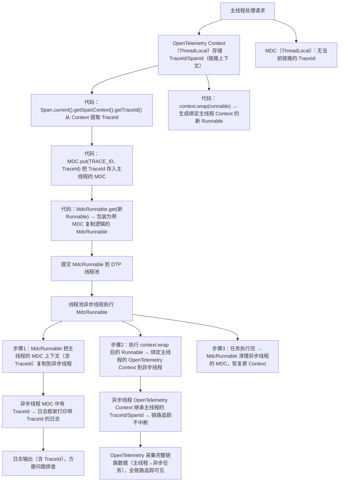

你这个理解**方向是对的**，但更精准的表述是：**OpenTelemetry 的 Context、ThreadLocal、日志 MDC 三者都是“线程上下文传递”的技术，但解决的问题、作用范围、实现机制有明显区别；这段代码正是把三者结合起来，让异步任务的链路追踪+日志上下文都能完整传递**。

我们先拆解核心类比，再讲清楚差异，你就能彻底理解：

### 一、核心共性：都是“线程上下文容器”
三者的本质都是**把数据绑定到当前线程**，让线程内的代码能便捷获取这些数据，核心解决“线程内数据传递”的问题：

| 技术 | 核心作用（绑定到当前线程） | 你的代码中对应的使用场景 |
|------|----------------------------|--------------------------|
| ThreadLocal | 通用的线程局部变量，存储任意线程私有数据 | MDC、OpenTelemetry Context 的底层都是基于 ThreadLocal 实现的 |
| MDC（日志上下文） | 专门存储日志相关的上下文数据（如 TraceId），供日志框架（SLF4J/Logback）打印 | 代码中把 TraceId 放入 MDC，让异步任务日志能打印 TraceId |
| OpenTelemetry Context | 专门存储链路追踪相关的上下文（TraceId、SpanId、采样率等），供 OpenTelemetry 采集链路数据 | 代码中获取当前 Context 并绑定到异步任务，保证链路追踪不中断 |

简单说：**ThreadLocal 是“底层容器”，MDC 和 OpenTelemetry Context 是“基于 ThreadLocal 封装的、有特定业务用途的上下文”**。

### 二、关键差异：解决的问题完全不同
| 维度 | ThreadLocal | 日志 MDC | OpenTelemetry Context |
|------|-------------|----------|-----------------------|
| **核心定位** | 通用工具：线程私有变量容器 | 业务工具：日志上下文传递 | 监控工具：全链路追踪上下文传递 |
| **存储数据** | 任意 Java 对象（无限制） | 日志相关的键值对（如 TraceId、userId） | 链路追踪元数据（TraceId、SpanId、父Span、采样规则等） |
| **作用范围** | 仅当前线程（默认） | 仅当前线程（默认），日志打印时读取 | 跨线程/跨进程/跨服务（分布式链路） |
| **核心问题** | 解决“线程内数据共享”，避免方法传参繁琐 | 解决“日志关联请求上下文”，方便排查问题 | 解决“分布式系统全链路追踪”，还原请求调用路径 |
| **异步传递** | 需手动处理（如包装 Runnable 复制 ThreadLocal） | 需手动包装（如 DTP 的 MdcRunnable） | 自带 `Context.wrap()` 方法，便捷支持异步传递 |

### 三、结合你的代码，看三者如何协作
你的代码正是把三者的能力结合，解决“异步任务上下文丢失”的问题，流程如下：

### 四、关键补充：为什么不直接用 ThreadLocal 替代？
你可能会问：“既然底层都是 ThreadLocal，为什么还要 MDC 和 OpenTelemetry Context？”
1. **职责单一**：ThreadLocal 是通用工具，无业务语义；MDC 专为日志设计，OpenTelemetry Context 专为链路追踪设计，API 更贴合场景（比如 MDC 有 `put/get/clear`，Context 有 `wrap/with`）；
2. **安全保障**：MDC/Context 都封装了“上下文清理、异步传递、线程隔离”的逻辑，避免直接用 ThreadLocal 导致的内存泄漏、上下文污染（比如异步任务执行完不清理 ThreadLocal，会影响线程池复用）；
3. **生态集成**：OpenTelemetry Context 能和各种框架（Spring、Dubbo、Redis）集成，自动传递上下文；MDC 能和日志框架无缝配合，直接在日志模板中用 `%X{traceId}` 打印数据——这些都是直接用 ThreadLocal 做不到的。

### 总结
1. **共性**：三者都是“线程上下文传递”的技术，底层都依赖 ThreadLocal 实现“数据绑定到当前线程”；
2. **差异**：
    - ThreadLocal 是通用底层容器，无业务语义；
    - MDC 是日志专属的上下文，解决“日志关联请求”；
    - OpenTelemetry Context 是链路追踪专属的上下文，解决“分布式全链路监控”；
3. **你的代码逻辑**：把 OpenTelemetry Context 中的核心数据（TraceId）同步到 MDC，再通过 OpenTelemetry 的 `Context.wrap()` + DTP 的 `MdcRunnable`，让这两个上下文都能传递到异步任务，最终实现“链路追踪不中断 + 日志 TraceId 不丢失”。

简单说：ThreadLocal 是“抽屉”，MDC 是“专门放日志小票的抽屉”，OpenTelemetry Context 是“专门放链路追踪小票的抽屉”；你的代码就是把“链路小票”复制一份到“日志小票抽屉”，再把两个抽屉都搬到异步任务的线程里，保证小票不丢。