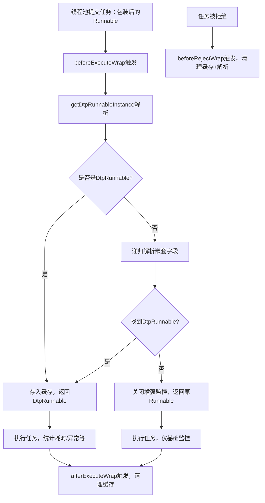

你这段代码是动态线程池（DTP）框架中的一个**任务包装/感知处理器（AgentAware）**，核心作用是：**在任务执行的全生命周期（执行前、执行后、被拒绝时），通过反射递归解析 Runnable 任务的嵌套结构，找到底层封装的 `DtpRunnable` 实例，为后续的任务执行监控、耗时统计、异常追踪等功能提供支撑；同时通过缓存和软引用优化内存使用，避免内存溢出**。

### 核心背景铺垫
在 DTP 框架中，`DtpRunnable` 是对原生 `Runnable` 的增强封装，里面包含了任务的元信息（如任务名称、提交时间、所属线程池名称等）和统计指标（执行耗时、是否异常等）。但实际业务中，`Runnable` 任务可能被多层包装（比如 Spring、Guava、业务自定义的包装类），直接拿到的 `Runnable` 并不是 `DtpRunnable`，因此需要这个 `AgentAware` 来“穿透”包装层，找到真正的 `DtpRunnable`。

### 代码逐模块解析
#### 1. 核心成员变量：任务缓存
```java
// 缓存原生Runnable -> 对应的DtpRunnable（软引用避免内存溢出）
private final Map<Runnable, SoftReference<DtpRunnable>> dtpRunnableCache = new ConcurrentHashMap<>();
```
- `ConcurrentHashMap`：保证多线程环境下的线程安全（线程池是多线程场景）；
- `SoftReference`（软引用）：当 JVM 内存不足时，会自动回收这些引用，避免缓存大量任务导致 OOM；
- 作用：缓存已解析过的 `Runnable` 对应的 `DtpRunnable`，避免重复反射解析，提升性能。

#### 2. 优先级与名称：框架扩展标识
```java
@Override
public int getOrder() {
    return Integer.MIN_VALUE; // 优先级最高（值越小优先级越高），确保最先执行该Aware的包装逻辑
}

@Override
public String getName() {
    return "agent"; // 标识该Aware的名称，用于日志/扩展管理
}
```
- `getOrder()` 返回 `Integer.MIN_VALUE`：保证这个感知器在所有 `TaskStatAware` 实现类中**最先执行**，确保后续的监控逻辑能拿到正确的 `DtpRunnable`；
- `getName()` 是框架的标准化扩展要求，用于区分不同的感知器。

#### 3. 核心解析逻辑：递归查找嵌套的 DtpRunnable
这部分是核心，包含 `determineDtpRunnable` 和 `getDtpRunnable` 两个递归方法，作用是**穿透多层包装的 Runnable，找到底层的 DtpRunnable**。

##### （1）`getDtpRunnable`：逐层遍历类结构
```java
private DtpRunnable getDtpRunnable(Class<? extends Runnable> rClass, Runnable r, Set<Class> visitedClass) throws IllegalAccessException {
    // 循环遍历当前类及其父类（只要父类实现了Runnable）
    while (Runnable.class.isAssignableFrom(rClass)) {
        // 获取当前类的所有声明字段
        Field[] declaredFields = rClass.getDeclaredFields();
        if (ArrayUtil.isNotEmpty(declaredFields)) {
            // 筛选出类型为Runnable的字段（包装类通常会持有真正的Runnable任务）
            List<Field> conditionFields = Arrays.stream(declaredFields)
                    .filter(ele -> Runnable.class.isAssignableFrom(ele.getType()))
                    .collect(Collectors.toList());
            if (CollectionUtils.isNotEmpty(conditionFields)) {
                // 递归解析这些Runnable字段，找到DtpRunnable
                DtpRunnable dtpRunnable = determineDtpRunnable(conditionFields, r, visitedClass);
                if (Objects.nonNull(dtpRunnable)) {
                    return dtpRunnable;
                }
            }
        }
        // 终止条件：父类不再实现Runnable，停止遍历
        if (!Runnable.class.isAssignableFrom(rClass.getSuperclass())) {
            break;
        }
        // 继续遍历父类
        rClass = (Class<? extends Runnable>) rClass.getSuperclass();
    }
    return null;
}
```

##### （2）`determineDtpRunnable`：遍历字段并递归查找
```java
private DtpRunnable determineDtpRunnable(List<Field> conditionalFields, Runnable r, Set<Class> visitedClass) throws IllegalAccessException {
    for (Field field : conditionalFields) {
        if (Objects.isNull(field)) {
            continue;
        }
        field.setAccessible(true); // 突破私有字段访问限制
        // 获取字段的值（即被包装的Runnable）
        Runnable o = (Runnable) field.get(r);
        // 找到目标：字段值本身就是DtpRunnable
        if (o instanceof DtpRunnable) {
            return (DtpRunnable) o;
        }
        // 终止条件：字段值为空，或已遍历过该类（避免循环引用）
        if (Objects.isNull(o) || CollUtil.contains(visitedClass, o.getClass())) {
            return null;
        } else {
            visitedClass.add(o.getClass()); // 标记已遍历，防止循环递归
        }
        // 纵向递归：继续解析这个字段对应的Runnable
        DtpRunnable dtpRunnable = getDtpRunnable(o.getClass(), o, visitedClass);
        if (dtpRunnable != null) {
            return dtpRunnable;
        }
    }
    return null;
}
```

##### （3）`getDtpRunnableInstance`：入口方法
```java
private Runnable getDtpRunnableInstance(Runnable r) {
    // 基础判断：如果本身就是DtpRunnable，直接返回
    if (r instanceof DtpRunnable) {
        return r;
    }
    DtpRunnable dtpRunnable = null;
    Class<? extends Runnable> rClass = r.getClass();
    try {
        // 递归解析嵌套结构，找DtpRunnable
        dtpRunnable = getDtpRunnable(rClass, r, new HashSet<>());
    } catch (IllegalAccessException e) {
        log.error("getDtpRunnable Error", e);
    }
    // 没找到则返回原Runnable，同时打日志
    if (dtpRunnable == null) {
        if (log.isDebugEnabled()) {
            log.debug("DynamicTp aware [{}], can not find DtpRunnable.", getName());
        }
        return r;
    }
    return dtpRunnable;
}
```

#### 4. 任务生命周期钩子：执行前/后/拒绝时的处理
`AgentAware` 继承自 `TaskStatAware`，重写了任务生命周期的三个核心钩子方法，核心是在关键节点解析并缓存 `DtpRunnable`：

##### （1）`beforeExecuteWrap`：任务执行前
```java
@Override
public Runnable beforeExecuteWrap(Executor executor, Thread t, Runnable r) {
    // 解析出DtpRunnable（或原Runnable）
    Runnable runnableWrap = getDtpRunnableInstance(r);
    // 如果解析到DtpRunnable，存入缓存（软引用）
    if (runnableWrap instanceof DtpRunnable) {
        dtpRunnableCache.put(r, new SoftReference<>((DtpRunnable) runnableWrap));
    } else {
        // 没找到则关闭增强监控，防止内存溢出
        System.setProperty(DTP_EXECUTE_ENHANCED, FALSE_STR);
    }
    return runnableWrap; // 返回解析后的任务，供后续执行
}
```

##### （2）`afterExecuteWrap`：任务执行后
```java
@Override
public Runnable afterExecuteWrap(Executor executor, Runnable r, Throwable t) {
    // 从缓存移除并获取DtpRunnable（执行后清理缓存，避免内存占用）
    SoftReference<DtpRunnable> remove = dtpRunnableCache.remove(r);
    if (remove != null) {
        return remove.get();
    }
    // 缓存中没有则重新解析（兜底）
    return getDtpRunnableInstance(r);
}
```

##### （3）`beforeRejectWrap`：任务被拒绝时
```java
@Override
public Runnable beforeRejectWrap(Runnable r, Executor executor) {
    // 逻辑同afterExecuteWrap：清理缓存 + 兜底解析
    SoftReference<DtpRunnable> remove = dtpRunnableCache.remove(r);
    if (remove != null) {
        return remove.get();
    }
    return getDtpRunnableInstance(r);
}
```

### 核心流程示意图


### 总结
1. **核心功能**：穿透多层包装的 `Runnable` 任务，递归查找底层的 `DtpRunnable` 增强实例，为 DTP 框架的任务监控、耗时统计、异常追踪提供基础；
2. **核心设计**：
    - 递归反射：遍历任务类及其父类的 `Runnable` 字段，突破嵌套包装；
    - 缓存优化：用 `ConcurrentHashMap + SoftReference` 缓存解析结果，提升性能且避免 OOM；
    - 生命周期钩子：在任务执行前/后/被拒绝时处理，保证监控全链路覆盖；
    - 安全兜底：解析失败时关闭增强监控，防止内存溢出，同时兼容基础功能；
3. **核心价值**：解决了“任务被多层包装后，框架无法获取增强元信息”的问题，是 DTP 框架实现精细化任务监控的关键组件。

简单说，这个类就是 DTP 框架的“任务解析探针”，不管任务被多少层包装，都能找到框架自己封装的 `DtpRunnable`，从而实现对任务执行全生命周期的精准监控。

我们用一个**真实业务场景**来举例，你就能瞬间明白 `AgentAware` 的作用。

### 场景前提
1. **DTP 框架的核心目标**：要统计每个任务的**执行耗时**、**所属线程池**、**是否异常**等指标，这些指标都存在于框架自定义的 `DtpRunnable` 中。
2. **业务中的常见操作**：我们提交的任务经常会被**多层包装**（比如 Spring 的异步包装、Guava 的工具类包装、业务自己的包装），导致直接拿到的 `Runnable` 不是 `DtpRunnable`。

### 举个具体的多层包装例子
假设我们有三层包装的任务：
```java
// 1. 最底层：DTP框架封装的增强任务（包含监控指标）
DtpRunnable dtpTask = new DtpRunnable(() -> {
    System.out.println("实际业务逻辑：处理订单");
}, "order-task-pool"); // 绑定线程池名称

// 2. 中间层：业务自定义包装（比如加日志）
class BizLogRunnable implements Runnable {
    private final Runnable target; // 持有底层任务

    public BizLogRunnable(Runnable target) {
        this.target = target;
    }

    @Override
    public void run() {
        System.out.println("业务日志：任务开始执行");
        target.run();
        System.out.println("业务日志：任务执行结束");
    }
}
Runnable bizTask = new BizLogRunnable(dtpTask);

// 3. 最外层：Spring异步包装（比如@Async生成的代理类）
class SpringAsyncRunnable implements Runnable {
    private final Runnable delegate; // 持有中间层任务

    public SpringAsyncRunnable(Runnable delegate) {
        this.delegate = delegate;
    }

    @Override
    public void run() {
        // Spring的异步上下文处理
        delegate.run();
    }
}
// 最终提交给线程池的任务
Runnable finalTask = new SpringAsyncRunnable(bizTask);
```

此时，线程池拿到的任务是 `finalTask`（类型是 `SpringAsyncRunnable`），它的结构是：
`SpringAsyncRunnable → BizLogRunnable → DtpRunnable`

### 没有 AgentAware 会发生什么？
如果没有 `AgentAware`，DTP 框架拿到 `finalTask` 后，只能识别为普通 `Runnable`，**无法获取底层的 `DtpRunnable`**，导致：
- 无法统计任务的执行耗时、所属线程池；
- 无法触发任务异常告警；
- 监控指标全部失效。

### AgentAware 是如何解决这个问题的？
我们把 `finalTask` 提交给 DTP 线程池，`AgentAware` 会在 `beforeExecuteWrap` 阶段介入，执行以下步骤：

#### 步骤1：触发 `beforeExecuteWrap` 钩子
```java
// 线程池执行任务前，调用AgentAware的beforeExecuteWrap
Runnable wrapped = agentAware.beforeExecuteWrap(executor, thread, finalTask);
```

#### 步骤2：`getDtpRunnableInstance` 开始解析
```java
// 传入的r是finalTask（SpringAsyncRunnable类型）
private Runnable getDtpRunnableInstance(Runnable r) {
    // 1. 判断r是不是DtpRunnable？否（是SpringAsyncRunnable）
    if (!(r instanceof DtpRunnable)) {
        // 2. 调用getDtpRunnable，开始递归解析
        return getDtpRunnable(r.getClass(), r, new HashSet<>());
    }
    return r;
}
```

#### 步骤3：递归穿透包装层（核心）
`getDtpRunnable` 方法开始处理 `SpringAsyncRunnable` 类：
1. **解析 SpringAsyncRunnable**
    - 获取该类的所有字段 → 找到 `delegate` 字段（类型是 `Runnable`）；
    - 反射获取 `delegate` 的值 → 是 `bizTask`（`BizLogRunnable` 类型）；
    - 判断是不是 `DtpRunnable`？否 → 继续递归解析 `BizLogRunnable`。

2. **解析 BizLogRunnable**
    - 获取该类的所有字段 → 找到 `target` 字段（类型是 `Runnable`）；
    - 反射获取 `target` 的值 → 是 `dtpTask`（`DtpRunnable` 类型）；
    - 判断是不是 `DtpRunnable`？是 → 停止递归，返回 `dtpTask`。

#### 步骤4：缓存结果并返回
```java
// beforeExecuteWrap中，把解析结果存入缓存
dtpRunnableCache.put(finalTask, new SoftReference<>(dtpTask));
// 返回真正的DtpRunnable，供后续监控使用
return dtpTask;
```

#### 步骤5：DTP 框架拿到 DtpRunnable，监控生效
线程池执行的是 `dtpTask`，框架可以：
- 记录任务开始时间 → 执行结束后计算耗时；
- 获取 `order-task-pool` 线程池名称 → 关联监控指标；
- 捕获任务异常 → 触发告警。

### 任务执行后：清理缓存
任务执行完后，`afterExecuteWrap` 会被触发：
```java
@Override
public Runnable afterExecuteWrap(Executor executor, Runnable r, Throwable t) {
    // 移除缓存，释放内存（SoftReference + 主动移除，双重保障不OOM）
    SoftReference<DtpRunnable> remove = dtpRunnableCache.remove(r);
    return remove.get();
}
```

### 总结这个例子的核心价值
| 场景 | 没有 AgentAware | 有 AgentAware |
|------|----------------|--------------|
| 任务识别 | 只能看到最外层的 `SpringAsyncRunnable`，无法获取监控元信息 | 穿透三层包装，精准找到底层 `DtpRunnable` |
| 监控能力 | 无耗时、无线程池关联、无异常告警 | 全量监控指标生效，支持精细化运维 |
| 内存安全 | 无缓存，重复解析性能低；或硬引用缓存导致 OOM | 软引用缓存 + 执行后清理，兼顾性能和内存安全 |

简单说，`AgentAware` 就是 DTP 框架的**“透视眼”**——不管任务被多少层包装，它都能穿透找到框架自己的增强任务，让监控功能在任何包装场景下都能正常工作。

---

需要我帮你写一个**可运行的测试类**，模拟这个多层包装任务的解析过程吗？