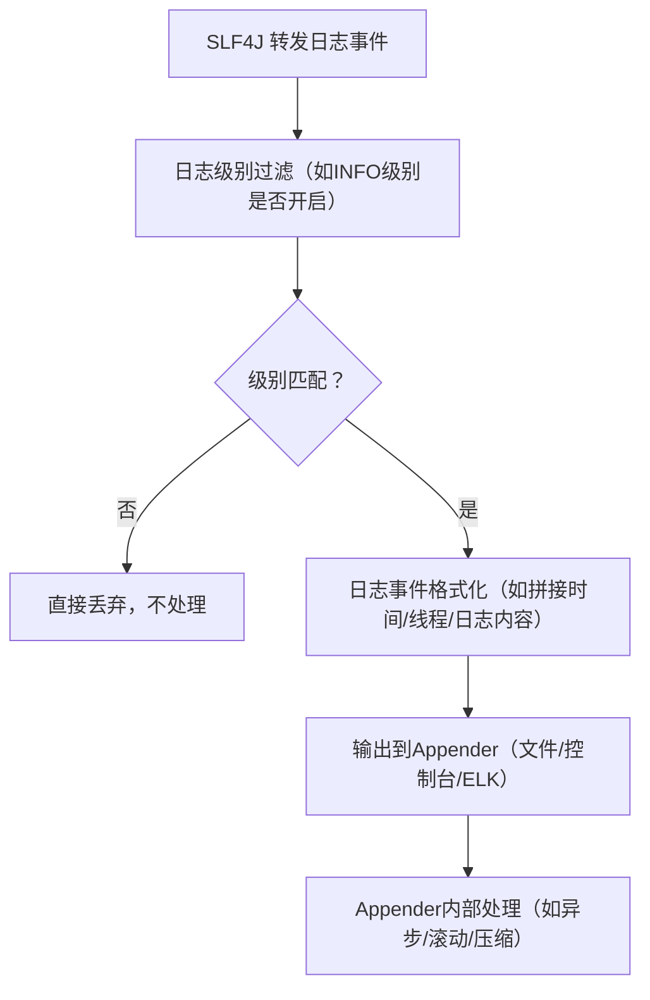

你想了解 Log4j2 和 Logback 的**具体实现细节**，核心可以从「日志处理核心流程」「核心组件设计」「性能优化手段」「关键差异」四个维度拆解——这两个都是遵循 SLF4J 门面规范的日志实现，但底层架构、性能设计、功能支持有显著区别，也是企业选择 Log4j2 居多的核心原因。

先明确核心前提：无论是 Log4j2 还是 Logback，本质都是**接收 SLF4J 转发的日志事件 → 按配置规则处理 → 输出到指定目的地**，但内部实现的“效率”“扩展性”“功能丰富度”差异极大。

### 一、先掌握日志实现的通用核心流程（Log4j2/Logback 都遵循）
不管是哪个实现，处理一条日志（如 `log.info("xxx")`）的核心流程都可以概括为：

下面的实现细节，都是围绕这个流程做的“底层优化”和“功能扩展”。

### 二、Log4j2 核心实现细节（高性能、高扩展）
Log4j2 是 Apache 新一代日志框架，核心设计目标是「高性能」「高扩展」「功能全面」，底层基于**插件化架构** + **异步日志核心**实现。

#### 1. 核心架构与组件（插件化设计）
Log4j2 所有核心组件都是**可插拔的插件**（通过 `@Plugin` 注解注册），无需修改源码即可扩展，核心组件包括：

| 组件          | 作用                                                                 | 实现细节                                                                 |
|---------------|----------------------------------------------------------------------|--------------------------------------------------------------------------|
| `Logger`      | 接收日志事件（对应 SLF4J 的 Logger）| 每个 Logger 绑定 `LoggerConfig`，支持“继承性”（如 `com.example` 继承 `com` 的配置）； 级别过滤在 Logger 层先做快速判断（不匹配直接返回，减少后续开销）。 |
| `LoggerConfig`| 日志规则配置（级别、Appender 关联、过滤器）| 存储 Logger 的核心配置，支持动态更新（无需重启应用，配置文件修改后自动生效）。 |
| `Appender`    | 日志输出目的地（文件/控制台/网络/数据库）| 核心实现： - `ConsoleAppender`：输出到控制台，基于 JDK `System.out` 封装； - `RollingFileAppender`：文件滚动输出，支持按时间/大小分割，内置压缩逻辑； - `AsyncAppender`：异步输出核心，底层基于 `Disruptor` 高性能队列（无锁环形队列）。 |
| `Layout`      | 日志格式化（如 `%d{yyyy-MM-dd} [%t] %-5level %logger - %msg%n`）| 支持自定义 Pattern 解析，底层用 `PatternParser` 解析格式化表达式，预编译表达式减少重复解析开销； 支持 JSON/XML 结构化输出（`JsonLayout`），适配日志平台。 |
| `Filter`      | 日志过滤（如按内容/线程/标记过滤）| 支持“全局过滤”“Logger过滤”“Appender过滤”多层过滤，底层用责任链模式，过滤逻辑可插拔。 |
| `Configuration` | 全局配置管理（解析 log4j2.xml/yaml）| 基于 `ConfigurationFactory` 解析配置文件，支持运行时动态更新（通过 `LoggerContext.updateLoggers()`）； 配置解析后缓存为内存对象，避免重复读文件。 |

#### 2. 核心性能优化细节（Log4j2 性能碾压的关键）
Log4j2 相比 Logback 最大的优势是**异步日志实现**，也是企业级高并发场景选择它的核心原因：
- **异步日志核心：Disruptor 无锁队列**  
  Log4j2 的异步日志（`AsyncLogger`/`AsyncAppender`）底层基于 Disruptor 框架（LMAX 开发的高性能无锁环形队列），相比传统的 `BlockingQueue`：
    - 无锁设计：避免线程竞争的锁开销，高并发下吞吐量提升 10 倍以上；
    - 批量消费：队列满时批量处理日志事件，减少 IO 次数；
    - 线程隔离：日志生产（业务线程）和消费（输出线程）完全隔离，业务线程不阻塞。
- **垃圾回收优化**  
  Log4j2 大量使用「对象池」复用日志事件对象，减少频繁创建/销毁对象导致的 GC；  
  异步日志模式下，日志事件在 Disruptor 队列中以数组形式存储，减少对象引用开销。
- **锁粒度极致优化**  
  核心组件（如 LoggerConfig）使用 `AtomicReference` 做无锁更新，替代 synchronized 重量级锁；  
  Appender 输出时按“Appender 实例”加锁，而非全局锁，减少锁竞争。

#### 3. 功能扩展细节
- **动态配置更新**：支持配置文件修改后自动刷新（默认 30 秒检测一次），无需重启应用；
- **自定义插件**：通过 `@Plugin` 注解可自定义 Appender/Layout/Filter，比如对接企业自研日志平台；
- **高可用保障**：异步日志队列满时，支持“丢弃最旧日志”“阻塞业务线程”“触发告警”等策略，避免日志丢失或业务阻塞；
- **参数化日志优化**：SLF4J 的 `log.info("用户{}操作{}", id, action)` 会被 Log4j2 直接解析为参数化事件，避免字符串拼接（即使日志级别不匹配，也不会产生拼接开销）。

### 三、Logback 核心实现细节（轻量、简洁）
Logback 是 Log4j 1.x 作者设计的新一代框架，核心目标是「轻量」「易配置」「适配 SLF4J 原生」，但性能和扩展性弱于 Log4j2。

#### 1. 核心架构与组件（简洁但扩展性弱）
Logback 组件设计更简单，无插件化架构，核心组件和 Log4j2 一一对应，但实现更轻量化：

| 组件          | 作用                                                                 | 实现细节                                                                 |
|---------------|----------------------------------------------------------------------|--------------------------------------------------------------------------|
| `Logger`      | 接收日志事件                                                         | 基于继承树设计（Root Logger 是根节点），级别过滤逻辑简单，但无无锁优化； 不支持动态更新 Logger 配置（修改配置需重启应用）。 |
| `Appender`    | 日志输出目的地                                                       | 核心实现： - `ConsoleAppender`：极简封装 `System.out`，无性能优化； - `RollingFileAppender`：支持文件滚动，但滚动策略（如 TimeBasedRollingPolicy）实现较简单，无批量处理； - `AsyncAppender`：异步输出基于 `BlockingQueue`（有锁队列），高并发下阻塞概率高。 |
| `Encoder`     | 日志格式化（替代 Log4j2 的 Layout）| 仅支持 Pattern 格式化，无 JSON 原生支持（需依赖第三方扩展）； 格式化逻辑无预编译，每次日志都要解析 Pattern，性能略低。 |
| `Filter`      | 日志过滤                                                             | 仅支持简单的级别过滤和自定义 Filter，无多层过滤体系，扩展性差。 |

#### 2. 核心实现痛点（也是企业弃用的原因）
- **异步日志性能差**：AsyncAppender 基于 `BlockingQueue`，高并发下线程竞争锁的开销大，吞吐量远低于 Log4j2 的 Disruptor 队列；
- **配置动态更新弱**：修改 logback.xml 后，需手动调用 `LoggerContext.reload()`，或依赖第三方组件实现自动刷新，原生不支持；
- **功能单一**：无原生结构化日志（JSON）、无批量日志处理、无垃圾回收优化，高并发场景下 GC 频繁；
- **扩展性差**：无插件化架构，自定义 Appender/Filter 需继承抽象类并重写方法，无法动态注册。

### 三、Log4j2 vs Logback 核心实现差异（企业选型关键）
| 实现维度         | Log4j2 实现细节                                                      | Logback 实现细节                                                      |
|------------------|-----------------------------------------------------------------------|-----------------------------------------------------------------------|
| 异步日志核心     | 基于 Disruptor 无锁环形队列，无锁竞争，高并发吞吐量提升 10 倍以上      | 基于 BlockingQueue 有锁队列，高并发下锁竞争严重，吞吐量低              |
| 架构设计         | 插件化架构（@Plugin 注解），支持动态扩展、动态注册组件                | 硬编码架构，组件需继承抽象类，无动态扩展能力                          |
| 配置动态更新     | 原生支持配置文件自动刷新（默认 30 秒检测），无需重启                  | 原生不支持，需手动调用 API 或第三方扩展                              |
| 内存/GC 优化     | 对象池复用日志事件对象，减少 GC；无锁设计减少线程上下文切换           | 无对象池，每次日志创建新对象，GC 频繁；有锁设计增加上下文切换          |
| 功能丰富度       | 支持 JSON 结构化日志、批量日志处理、日志压缩、数据库/Appender 等       | 仅支持基础文件/控制台输出，结构化日志需第三方扩展                     |
| 异常处理         | 异步日志队列满时支持多种策略（丢弃/阻塞/告警），避免业务阻塞          | 队列满时直接阻塞业务线程，易导致应用卡顿                              |

### 四、关键实现细节补充（底层技术）
#### 1. Log4j2 无锁异步日志的核心（Disruptor 队列）
Disruptor 是 LMAX 开发的高性能无锁队列，Log4j2 集成后，异步日志的核心实现：
- 业务线程将日志事件“写入”Disruptor 队列（无锁 CAS 操作），立即返回，不阻塞；
- 消费线程单独处理队列中的日志事件，输出到 Appender；
- 队列采用环形数组设计，避免内存碎片，且预分配内存，减少 GC。

#### 2. Logback 同步日志的核心（简单但低效）
Logback 默认是同步日志，每条日志的处理都在**业务线程**中完成：
- 业务线程执行 `log.info()` 时，需等待日志格式化、输出完成后才能继续；
- 若输出到文件，还需等待磁盘 IO 完成，高并发下业务线程阻塞严重。

#### 3. 日志格式化的底层实现
- Log4j2：预编译 Pattern 表达式为 `PatternParser` 对象，一次解析多次使用，减少字符串拼接开销；
- Logback：每次日志都重新解析 Pattern 表达式，字符串拼接用 `StringBuilder`，无预编译优化。

### 四、总结（核心实现细节回顾）
1. **Log4j2 核心优势**：无锁异步（Disruptor）、插件化架构、动态配置、GC 优化，是高并发企业场景的首选；
2. **Logback 核心优势**：轻量、简洁、适配 SLF4J 原生，适合低并发、简单场景（如小型应用、测试环境）；
3. **企业选型逻辑**：高并发生产环境选 Log4j2（性能/扩展/功能），小型应用/测试环境选 Logback（轻量/易配置）。

简单来说：
- Log4j2 是“性能极致优化+功能全面”的企业级实现，底层用了无锁队列、对象池、插件化等高级技术；
- Logback 是“够用就好”的轻量级实现，底层设计简单，但高并发下性能和稳定性不足。

这也是为什么你在企业中看到的大多是「SLF4J + Log4j2」组合——既享受门面模式的解耦，又能利用 Log4j2 的高性能和丰富功能。