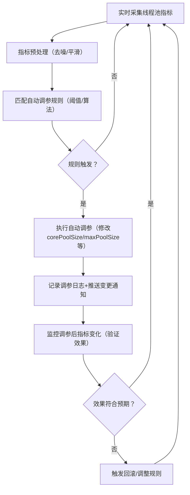

你提出的这个问题，正是动态线程池的**进阶形态——“智能动态线程池”**（也叫自适应线程池）的核心思路：**通过监控线程池核心指标，结合预设规则/算法自动调整参数，无需人工介入**。答案是：**完全可以实现，且这是生产环境中动态线程池的最佳实践**。

下面我会从「实现思路、核心监控指标、自动调整策略、落地方案、注意事项」五个维度，结合你熟悉的 Dubbo/RabbitMQ 场景讲清楚，让你知道具体该怎么做。

### 一、核心实现思路（从“手动调”到“自动调”）
智能动态线程池的核心逻辑是「指标采集 → 规则判断 → 自动调参 → 效果验证」的闭环，整体流程如下：


### 二、需要监控的核心指标（调参的“依据”）
自动调参的前提是**精准采集指标**，核心关注以下 8 个指标（按优先级排序）：
| 指标名称                | 含义                                                                 | 取值说明（以 Dubbo 线程池为例）| 调参关联逻辑                          |
|-------------------------|----------------------------------------------------------------------|------------------------------------------|---------------------------------------|
| 活跃线程数（activeCount） | 当前正在处理任务的线程数                                             | 正常值：0 ~ maximumPoolSize              | 持续接近 corePoolSize → 考虑调大 corePoolSize |
| 队列长度（queueSize）    | 等待执行的任务数                                                     | 正常值：0 ~ queueCapacity                | 持续超过队列容量 70% → 调大 maxPoolSize 或队列容量 |
| 拒绝次数（rejectedCount） | 线程池触发拒绝策略的次数（累计/分钟）| 正常值：0                                | 非0且持续增长 → 紧急调大 maxPoolSize 或扩容队列 |
| 任务执行耗时（avgTaskTime） | 单个任务的平均执行耗时                                               | 基线值：比如 Dubbo 接口平均 100ms        | 耗时突增2倍以上 → 调大 corePoolSize（抵消耗时影响） |
| CPU 使用率              | 线程池所在机器的CPU使用率                                           | 安全阈值：70%~80%（视机器配置）| 超过阈值 → 禁止调大线程数（否则上下文切换激增） |
| 空闲线程数（idleCount）  | 核心线程中处于空闲的线程数                                           | 正常值：corePoolSize - activeCount       | 持续超过 corePoolSize 50% → 调小 corePoolSize |
| 任务提交速率（taskRate） | 单位时间内提交的任务数（QPS）| 基线值：比如 Dubbo 正常 200QPS           | 突增3倍以上 → 临时调大 maxPoolSize      |
| 线程阻塞率              | 线程池中阻塞的线程占比（如IO阻塞/锁阻塞）| 正常值：<10%                             | 超过 30% → 调大 maxPoolSize（补充可用线程） |

#### 补充：指标采集方式
- **线程池原生指标**：通过 `ThreadPoolExecutor` 的 `getActiveCount()`、`getQueue().size()` 等方法直接获取（DTP 已封装为 `ThreadPoolExecutorProxy`，可直接采集）；
- **扩展指标**：拒绝次数、任务耗时、阻塞率等，需通过「任务包装+拦截器」实现（DTP 已内置这些采集逻辑）；
- **系统指标**：CPU 使用率通过 `java.lang.management.OperatingSystemMXBean` 采集。

### 三、自动调整的核心策略（从简单到复杂）
根据场景复杂度，可选择不同的自动调参策略（生产环境建议先从简单策略落地）：

#### 1. 阈值触发策略（入门级，易落地）
这是最常用的策略：为核心指标设置阈值，触发阈值时执行预设的调参动作，适合 Dubbo/RabbitMQ 等中间件线程池。
##### 举例（Dubbo 线程池自动调参规则）：
| 触发条件（持续30秒）| 调参动作                                  | 回滚条件（持续1分钟）|
|-------------------------------------------|-------------------------------------------|-------------------------------------------|
| activeCount ≥ corePoolSize × 80% + queueSize ≥ queueCapacity × 70% | corePoolSize += 20（不超过上限200）| activeCount ≤ corePoolSize × 50% → corePoolSize -= 10 |
| rejectedCount ≥ 10次/分钟                 | maxPoolSize += 30（不超过上限300）| rejectedCount = 0 → maxPoolSize -= 20     |
| CPU 使用率 ≥ 80%                          | 禁止调大线程数，可适当调小 maxPoolSize    | CPU 使用率 ≤ 60% → 恢复正常调参           |
| idleCount ≥ corePoolSize × 60%（低谷期）| corePoolSize -= 10（不低于下限10）| activeCount ≥ corePoolSize × 70% → 停止调小 |

##### 落地方式：
- 基于定时任务（如 ScheduledExecutorService），每隔 10 秒采集一次指标；
- 对比指标与阈值，触发则调用 DTP 的 `refresh` 方法修改参数；
- 记录每次调参的“前/后参数+指标值”，便于回滚/审计。

#### 2. 比例调整策略（进阶级，更灵活）
不固定调参数值，而是按**当前指标的比例**调整，适配不同规模的线程池：
```java
// 示例：按活跃线程数比例调大 corePoolSize
double activeRatio = (double) activeCount / corePoolSize;
if (activeRatio > 0.8 && cpuUsage < 70%) {
    // 按 20% 比例调大，最多不超过上限
    int newCoreSize = (int) (corePoolSize * 1.2);
    newCoreSize = Math.min(newCoreSize, corePoolSizeMax);
    dtpExecutor.setCorePoolSize(newCoreSize);
}
```

#### 3. 机器学习/自适应算法（高级级，适合超大规模）
对于日均亿级请求的核心系统（如电商交易链路），可基于历史流量数据训练模型：
- 输入：历史QPS、任务耗时、CPU使用率、线程池参数；
- 输出：最优的 corePoolSize/maxPoolSize；
- 实时预测：根据当前流量趋势，提前调整参数（比如秒杀前10分钟自动扩容）；
- 代表实现：阿里 Sentinel 的自适应限流、字节跳动 Titan 线程池的智能调参。

### 四、落地方案（基于 Dynamic-Tp 快速实现）
Dynamic-Tp 本身已内置「指标采集+配置刷新」能力，只需新增「自动调参规则引擎」即可实现，核心步骤：
#### 1. 新增自动调参配置（application.yml）
```yaml
dynamic-tp:
  auto-adjust:
    enabled: true  # 开启自动调参
    check-interval: 10s  # 指标检查间隔
    # Dubbo 线程池自动调参规则
    dubboTp:
      core-pool-size:
        min: 10
        max: 200
        up-threshold: 0.8  # 活跃线程数占比阈值（调大）
        down-threshold: 0.5 # 活跃线程数占比阈值（调小）
        step: 20  # 每次调整步长
      max-pool-size:
        min: 50
        max: 300
        reject-threshold: 10 # 每分钟拒绝次数阈值
        step: 30
    # RabbitMQ 线程池自动调参规则
    rabbitMqTp:
      # 同理配置...
```

#### 2. 实现自动调参核心类
```java
@Slf4j
@Component
public class DtpAutoAdjustService {

    @Autowired
    private DtpRegistry dtpRegistry; // DTP 线程池注册器

    @Value("${dynamic-tp.auto-adjust.check-interval:10s}")
    private Duration checkInterval;

    // 定时任务：每隔 checkInterval 检查指标并自动调参
    @Scheduled(fixedRateString = "${dynamic-tp.auto-adjust.check-interval:10000}")
    public void autoAdjust() {
        // 1. 获取所有已注册的动态线程池（Dubbo/RabbitMQ 等）
        Collection<DtpExecutor> executors = dtpRegistry.getDtpExecutors();
        for (DtpExecutor executor : executors) {
            try {
                // 2. 采集当前线程池指标
                DtpMonitorMetrics metrics = collectMetrics(executor);
                // 3. 匹配调参规则，执行自动调参
                adjustExecutor(executor, metrics);
            } catch (Exception e) {
                log.error("Auto adjust dtp executor {} failed", executor.getThreadPoolName(), e);
            }
        }
    }

    // 采集线程池指标
    private DtpMonitorMetrics collectMetrics(DtpExecutor executor) {
        ThreadPoolExecutorProxy proxy = (ThreadPoolExecutorProxy) executor;
        return DtpMonitorMetrics.builder()
                .activeCount(proxy.getActiveCount())
                .queueSize(proxy.getQueue().size())
                .queueCapacity(proxy.getQueue().remainingCapacity() + proxy.getQueue().size())
                .rejectedCount(proxy.getRejectedCount())
                .cpuUsage(getCpuUsage())
                .idleCount(proxy.getCorePoolSize() - proxy.getActiveCount())
                .build();
    }

    // 执行自动调参（核心：根据规则修改参数）
    private void adjustExecutor(DtpExecutor executor, DtpMonitorMetrics metrics) {
        String tpName = executor.getThreadPoolName();
        AutoAdjustRule rule = getAutoAdjustRule(tpName); // 获取该线程池的调参规则

        // 规则1：判断是否需要调大 corePoolSize
        double activeRatio = (double) metrics.getActiveCount() / executor.getCorePoolSize();
        if (activeRatio >= rule.getCorePoolSize().getUpThreshold() 
                && metrics.getCpuUsage() < 80%) {
            int newCoreSize = executor.getCorePoolSize() + rule.getCorePoolSize().getStep();
            newCoreSize = Math.min(newCoreSize, rule.getCorePoolSize().getMax());
            if (newCoreSize > executor.getCorePoolSize()) {
                executor.setCorePoolSize(newCoreSize);
                log.info("Auto adjust {} corePoolSize from {} to {}", 
                        tpName, executor.getCorePoolSize(), newCoreSize);
            }
        }

        // 规则2：判断是否需要调小 corePoolSize（低谷期）
        double idleRatio = (double) metrics.getIdleCount() / executor.getCorePoolSize();
        if (idleRatio >= rule.getCorePoolSize().getDownThreshold()) {
            int newCoreSize = executor.getCorePoolSize() - rule.getCorePoolSize().getStep();
            newCoreSize = Math.max(newCoreSize, rule.getCorePoolSize().getMin());
            if (newCoreSize < executor.getCorePoolSize()) {
                executor.setCorePoolSize(newCoreSize);
                log.info("Auto adjust {} corePoolSize from {} to {}", 
                        tpName, executor.getCorePoolSize(), newCoreSize);
            }
        }

        // 规则3：处理拒绝次数，调大 maxPoolSize（省略）
        // ...
    }

    // 获取系统CPU使用率（简化版）
    private double getCpuUsage() {
        OperatingSystemMXBean osBean = ManagementFactory.getOperatingSystemMXBean();
        return osBean.getSystemCpuLoad() * 100;
    }
}
```

#### 3. 增加回滚/熔断机制（避免调参出错）
- **参数回滚**：调参后监控指标，若指标恶化（如CPU飙升、拒绝次数增加），立即回滚到调参前的参数；
- **调参熔断**：单次调参后，锁定 5 分钟不重复调整同一参数（避免频繁震荡）；
- **人工兜底**：保留手动关闭自动调参的开关，故障时可切回手动模式。

### 五、注意事项（避免踩坑）
1. **设置参数上下限**：无论怎么自动调，corePoolSize/maxPoolSize 必须设上下限（比如 Dubbo 线程池 corePoolSize 最小10、最大200），防止无限扩容导致 OOM；
2. **指标平滑处理**：采集的指标可能有波动（比如瞬间的活跃线程数飙升），需做“滑动窗口平均”（如取30秒内的平均值），避免频繁调参；
3. **避免多线程竞争调参**：自动调参逻辑需加锁，防止同一线程池被多个定时任务同时修改参数；
4. **监控调参全链路**：记录每次调参的“时间、执行人（自动/手动）、调整前参数、调整后参数、触发指标”，便于问题排查；
5. **先灰度后全量**：新的自动调参规则先在测试环境/灰度机器验证，再全量推广。

### 总结
核心结论：
1. **完全可以实现**：基于 Dynamic-Tp 已有的指标采集和动态调参能力，新增「规则引擎+定时任务」即可实现自动调参；
2. **落地优先级**：先做「阈值触发策略」（易落地、效果明确），再逐步升级到比例策略/机器学习策略；
3. **核心价值**：从“人工盯指标手动调参”升级为“系统自动监控自动调参”，大幅降低运维成本，同时让线程池参数始终适配业务流量；
4. **关键保障**：必须有「参数上下限、指标平滑、回滚机制、全链路监控」，避免自动调参引发新问题。

简单说：自动调整的动态线程池，就是给线程池加了一个“智能大脑”——它会实时盯着线程池的“健康状况”，根据预设的“健康标准”自动调整资源配置，既不用人盯着，又能保证线程池始终处于最优状态。